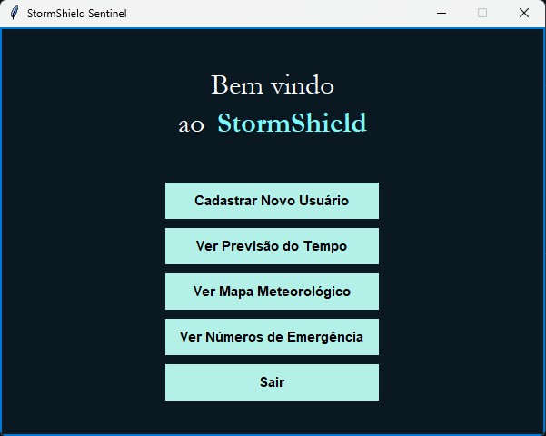

# StormShield Sentinel ⛈️


Um protótipo de aplicação de desktop para monitoramento meteorológico e simulação de alertas de alagamento, desenvolvido com Python e Tkinter.

## 📸 Screenshot




## 📖 Sobre o Projeto

O **StormShield Sentinel** é uma aplicação que simula uma plataforma de monitoramento climático focada na prevenção de desastres naturais, como enchentes. O objetivo é oferecer uma ferramenta que permita o cadastro de usuários, associe-os a uma localização e os notifique proativamente sobre riscos climáticos iminentes.

Este projeto foi desenvolvido como parte dos estudos de Software and Total Experience, com foco em lógica de programação, modularidade e desenvolvimento de interfaces gráficas.

## ✨ Funcionalidades

O sistema oferece as seguintes funcionalidades simuladas:

* 📝 **Cadastro de Usuários:** Permite o registro de novos usuários com nome e telefone.
* 📱 **Validação de Telefone:** Implementa um sistema de confirmação com um código de 6 dígitos que expira em 5 minutos para garantir a validade do número.
* 🌦️ **Previsão do Tempo:** Exibe uma previsão simulada para os próximos 7 dias para a localização do usuário.
* 🗺️ **Mapa Meteorológico Simulado:** Apresenta um mapa simplificado em formato de texto com símbolos que representam as condições climáticas.
* 🚨 **Alertas de Risco:** Verifica periodicamente (a cada 30 segundos) os dados meteorológicos e emite alertas visuais (pop-ups) caso identifique risco "MODERADO" ou "ALTO" de alagamento.
* 📞 **Números de Emergência:** Acesso rápido a uma lista com os principais números de emergência (Defesa Civil, Bombeiros, etc.).
* 🎨 **Interface Estilizada:** Possui um tema visual coeso, com cores e fontes personalizadas.

## 🛠️ Tecnologias Utilizadas

* **Linguagem:** Python 3
* **Interface Gráfica (GUI):** Tkinter (biblioteca padrão do Python)
* **Bibliotecas Adicionais:** `random`, `datetime`, `re` (todas padrão do Python).

## 🚀 Como Executar o Projeto

Como o projeto utiliza apenas bibliotecas padrão do Python, não há necessidade de instalar pacotes externos.

### Pré-requisitos

* Ter o [Python 3](https://www.python.org/downloads/) instalado em sua máquina.

### Passos

1.  Clone o repositório para a sua máquina local:
    ```bash
    git clone [https://github.com/seu-usuario/seu-repositorio.git](https://github.com/seu-usuario/seu-repositorio.git)
    ```

2.  Navegue até o diretório do projeto:
    ```bash
    cd seu-repositorio
    ```

3.  Execute o script Python:
    ```bash
    python nome_do_seu_arquivo.py
    ```
    (Substitua `nome_do_seu_arquivo.py` pelo nome real do seu arquivo .py)

## 📂 Estrutura do Código

O código está organizado de forma modular para separar as responsabilidades:

* **Gerenciamento de Dados:** Dicionários e listas globais (`usuarios_cadastrados`, `alertas_emitidos`, etc.) simulam um banco de dados em tempo de execução.
* **Lógica Principal:** Funções independentes (`validar_formato_telefone`, `verificar_risco_alagamento`, etc.) que contêm as regras de negócio do sistema.
* **Interface Gráfica (GUI):** A classe `StormShieldApp` herda de `tk.Tk` e é responsável por construir e gerenciar todas as janelas, botões e interações com o usuário.

## ✍️ Autores

* **Vitor Ramos de Farias** (RM: 561958)
* **Carlos Eduardo Sanches Mariano** (RM: 561756)

## 📄 Licença

Este projeto está sob a licença MIT. Veja o arquivo [LICENSE](LICENSE.md) para mais detalhes.